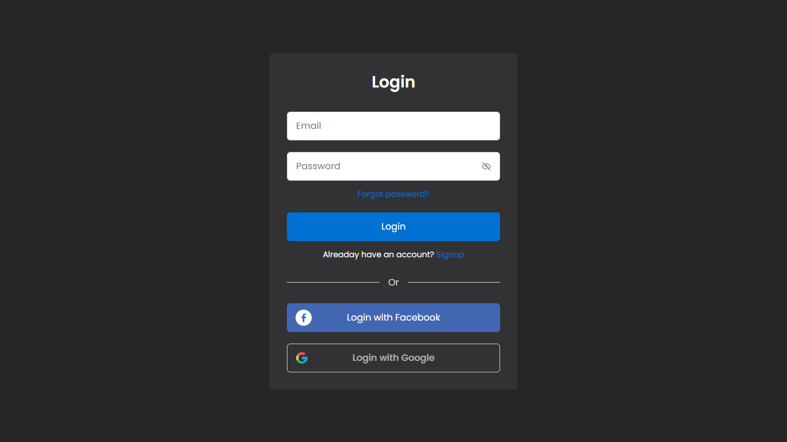

<h1 align="center"> Responsive Login and Signup </h1>

As páginas de login e cadastro foram realizas com o intuito de desenvolver habilidaes a cerca da tecnologia WEB.  

  <a href="#-tecnologias">Tecnologias</a>&nbsp;&nbsp;&nbsp;|&nbsp;&nbsp;&nbsp;
  <a href="#-projeto">Projeto</a>&nbsp;&nbsp;&nbsp;|&nbsp;&nbsp;&nbsp;
  <a href="#-layout">Layout</a>&nbsp;&nbsp;&nbsp;|&nbsp;&nbsp;&nbsp;
  <a href="#memo-licença">Licença</a>

  

 

  

## 🚀 Tecnologias

Esse projeto foi desenvolvido com as seguintes tecnologias:

- HTML e CSS
- JavaScript
- Git e Github
- Figma

## 💻 Projeto

Responsive Login and Signup exemplifica páginas para login e cadastro, de forma responsiva.

- [Visite o projeto online](https://denifercruz.github.io/Responsive-Login-and-Signup/)

## 🔖 Layout

## :memo: Licença

Esse projeto está sob a licença MIT.

---
